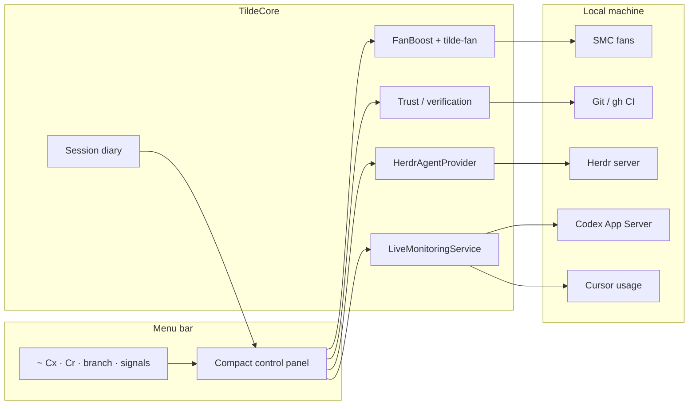

# Tilde

<p align="center">
  <code>~</code>
</p>

<p align="center">
  <strong>Native macOS menu-bar command center</strong><br/>
  Machine health · AI agent attention · Change verification · Local recovery
</p>

<p align="center">
  
  
  
  
</p>

---

Tilde lives in your menu bar and answers four questions without stealing focus:

| | Question | What Tilde shows |
| ---: | --- | --- |
| **1** | What needs me? | Blocked / ready Herdr agents, ordered by attention |
| **2** | What changed? | Branch, dirty state, ahead/behind, project context |
| **3** | Is it safe? | Deterministic Git · build · CI trust evidence |
| **4** | Where do I resume? | Private recovery capsule per project |

Editors edit. Herdr runs agents. **Tilde is the ambient layer between them.**

```text
  menu bar
  ┌──────────────────────────────────────────────────────────────┐
  │  ~  Cx 67% · Cr 45% · main* · ⚒ · !!                         │
  └──────────────────────────────────────────────────────────────┘
         │
         ▼  click
  ┌─────────────────────────────┐
  │  CPU sparkline · RAM · Disk │
  │  Fan Boost · Network        │
  │  AI · Codex ⇄ Cursor        │
  │  Agents that need you       │
  │  Trust · Build · Project    │
  │  Focus · Today              │
  └─────────────────────────────┘
```

## Highlights

<table>
<tr>
<td width="50%" valign="top">

### System HUD
Live CPU sparkline, memory pressure, disk, network, thermal slowdown alerts, and real **Fan Boost** (SMC via `tilde-fan`).

</td>
<td width="50%" valign="top">

### AI budget
One compact AI card that cycles **Codex ⇄ Cursor** remaining allowance. Menu title keeps both visible at a glance.

</td>
</tr>
<tr>
<td width="50%" valign="top">

### Agent attention
When Herdr is available, Tilde polls agent inventory, maps terminals → repos, and surfaces blockers before busy work.

</td>
<td width="50%" valign="top">

### Trust & recovery
Deterministic verification packets (no opaque “AI confidence”). Local recovery capsules store **metadata only**.

</td>
</tr>
</table>

## Quick start

**Requirements:** macOS 14+, Swift 6.1+. Xcode is optional for day-to-day SwiftPM runs; full Xcode is needed for XCTest / signing / distribution.

```sh
git clone https://github.com/Le0wang06/Tilde.git
cd Tilde
swift build
./Scripts/run-app.sh          # packages .app + registers tilde://
```

Or run the bare executable:

```sh
swift run TildeDiagnostics
```

| Command | Purpose |
| --- | --- |
| `./Scripts/run-app.sh` | Build, wrap as `.app`, launch, register URL scheme |
| `swift run tilde-probe` | Non-GUI feasibility / probe report |
| `./Scripts/test.sh` | Calculation and state tests |
| `open 'tilde://refresh'` | Deep-link refresh (after `run-app.sh`) |

### Deep links

| URL | Action |
| --- | --- |
| `tilde://open` | Open main window |
| `tilde://refresh` | Force metric refresh |
| `tilde://copy-status` | Copy HUD summary |
| `tilde://open-cursor` | Launch Cursor |
| `tilde://focus/ship` | Ship focus mode |
| `tilde://focus/meet` | Meet focus mode |
| `tilde://focus/battery` | Battery focus mode |

## Architecture



Sampling slows when the panel is closed so idle cost stays low. Manual refresh forces all metrics. Live samples stay **in memory** and are not written to disk.

<details>
<summary><strong>Sampling intervals</strong></summary>

| Metric | Visible | Background |
| --- | ---: | ---: |
| CPU and network | 1s | 5s |
| Memory and thermal | 2s | 10s |
| Battery | 15s | 60s |
| Storage | 60s | 5m |
| Codex usage | 60s | 2m |
| Cursor usage | 2m | 5m |
| Herdr agents | 2s | 2s |

</details>

## Privacy

Tilde is **local-first**. It does **not** persist:

- prompts or chat transcripts  
- source code or diffs  
- terminal output  
- auth tokens or account email  

Recovery capsules keep only project path, branch, attention counts, verification state, and a next-action hint under Application Support.

## Products in this repo

| Binary | Role |
| --- | --- |
| `TildeDiagnostics` | Menu-bar app + diagnostics window |
| `tilde-probe` | CLI feasibility report |
| `tilde-fan` | Privileged fan daemon / CLI (password once per login) |
| `TildeCore` | Shared monitoring, agents, trust, diary |

## Docs

- [AI Control Plane](Docs/AI-Control-Plane.md) — product promise, shipped slice, next increments  
- [Phase 0 Feasibility](Docs/Phase-0-Feasibility.md) — measured results and limits  
- [Contribution workflow](AGENTS.md)

## Status

Phase 0 diagnostics foundation is complete. The AI attention / verification vertical slice is in active dogfooding on this branch. Background idle CPU, notification spam, and false blocked/done rates are release gates — see the control-plane doc.

---

<p align="center">
  <sub>Built for people who already live in the menu bar.</sub><br/>
  <code>~</code>
</p>
