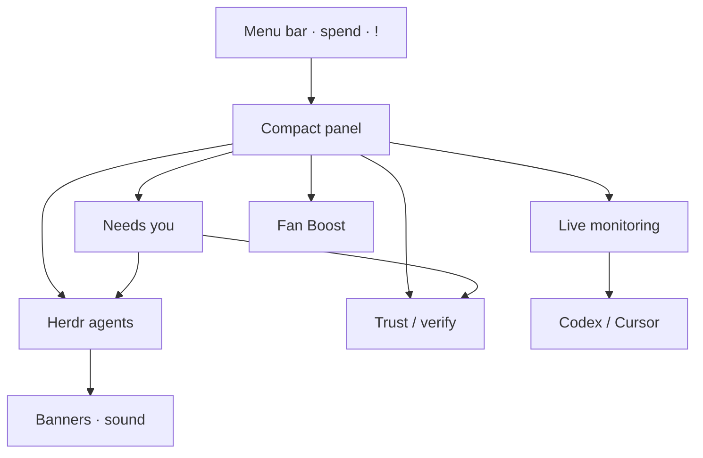

# Tilde

<p align="center">
  
</p>

<h1 align="center">Tilde</h1>

<p align="center">
  <strong>Native macOS menu-bar command center</strong><br/>
  See what needs you next — agents, verification, and machine health — without leaving flow.
</p>

<p align="center">
  
  
  
  
</p>

<p align="center">
  <a href="#install">Install</a> ·
  <a href="#gallery">Gallery</a> ·
  <a href="#features">Features</a> ·
  <a href="#privacy">Privacy</a> ·
  <a href="#docs">Docs</a>
</p>

<p align="center">
  
</p>

---

## Why Tilde

Editors edit. Herdr runs agents. **Tilde is the ambient layer between them.**

| | Question | What you see |
| ---: | --- | --- |
| **1** | What needs me? | **Needs you** — one change, why it matters, one primary action |
| **2** | What changed? | Branch, dirty state, ahead/behind, project context |
| **3** | Is it safe? | Exact verification receipts bound to the Git fingerprint |
| **4** | Where do I resume? | Private recovery capsule per project |

When an agent blocks or finishes a turn: menu-bar `!`, a short sound, and a native side banner (if notifications are allowed).

## Gallery

<p align="center">
  
</p>

<p align="center"><sub>Price-first menu bar — <code>!</code> when something needs attention</sub></p>

<p align="center">
  
</p>

<p align="center"><sub>Needs you → agents → verification → live machine health</sub></p>

```sh
./Scripts/capture-readme-assets.sh   # refresh screenshots anytime
```

## Features

| | |
| --- | --- |
| **Needs you** | Change-centered queue ranked by blocked agents, failed/stale checks, and review-ready work |
| **Attention alerts** | `!` on the spend title, local ping, Notification Center banners |
| **AI spend** | Daily Cursor + Codex estimate as the always-on menu title |
| **Exact verification** | `.tilde/verify.json` checks tied to the full change fingerprint |
| **Trust packet** | Deterministic Git / receipt / CI evidence — no opaque “AI confidence” |
| **System HUD** | CPU sparkline, RAM, disk, network, thermal slowdown alerts |
| **Fan Boost** | Real SMC control via `tilde-fan` |
| **Focus modes** | Ship · Meet · Battery |
| **Today diary** | Local JSONL of builds, focus, slowdowns, agent events |

## Install

**Requires** macOS 14+ and Swift 6.1+.

```sh
git clone https://github.com/Le0wang06/Tilde.git
cd Tilde
./Scripts/install-and-start.sh
```

That builds Tilde, installs `~/Applications/Tilde.app`, and sets a login item.

| Command | Purpose |
| --- | --- |
| `./Scripts/install-and-start.sh` | Install + launch menu-bar app |
| `./Scripts/run-app.sh` | Package `.app` and register `tilde://` |
| `./Scripts/test.sh` | Unit tests |
| `swift run tilde-probe` | Non-GUI feasibility report |

Allow **Notifications → Tilde** in System Settings for side banners.

### Deep links

| URL | Action |
| --- | --- |
| `tilde://open` | Open main window |
| `tilde://refresh` | Force refresh |
| `tilde://copy-status` | Copy HUD summary |
| `tilde://open-cursor` | Launch Cursor |
| `tilde://focus/ship` | Ship mode |
| `tilde://focus/meet` | Meet mode |
| `tilde://focus/battery` | Battery mode |

## Architecture



<details>
<summary>Sampling intervals</summary>

| Metric | Visible | Background |
| --- | ---: | ---: |
| CPU / network | 1s | 5s |
| Memory / thermal | 2s | 10s |
| Battery | 15s | 60s |
| Storage | 60s | 5m |
| Codex | 60s | 2m |
| Cursor | 2m | 5m |
| Herdr agents | 2s · **0.5s while working** | same |

</details>

## Privacy

**Local-first.** Tilde does **not** store prompts, diffs, terminal output, tokens, or account email.

Persisted metadata only: spend counters, recovery capsule fields, verification receipt hashes/outcomes, decision-queue paths/reasons, and diary event summaries. Command output from verification never hits disk.

## Exact verification

Declare reviewable checks in `.tilde/verify.json`. Tilde shows every command and requires **Trust & Run** for that repo + profile hash.

```json
{
  "version": 1,
  "base": "origin/main",
  "checks": [
    {
      "id": "tests",
      "name": "Tests",
      "command": "./Scripts/test.sh",
      "required": true,
      "timeoutSeconds": 900
    }
  ]
}
```

Receipts go stale when the fingerprint moves (base, `HEAD`, diffs, untracked, submodules, or profile).

## Repo layout

| Product | Role |
| --- | --- |
| `TildeDiagnostics` | Menu-bar app |
| `tilde-probe` | CLI probe |
| `tilde-fan` | Privileged fan daemon |
| `TildeCore` | Monitoring, agents, trust, decision queue |

## Docs

- [AI Control Plane](Docs/AI-Control-Plane.md)
- [Phase 0 Feasibility](Docs/Phase-0-Feasibility.md)
- [Contribution workflow](AGENTS.md)

## Status

Dogfooding **Needs you**, attention banners, and exact verification. Gates: idle CPU, no launch spam, low false attention rates.

---

<p align="center">
  <br/>
  <sub>Built for people who already live in the menu bar.</sub>
</p>
