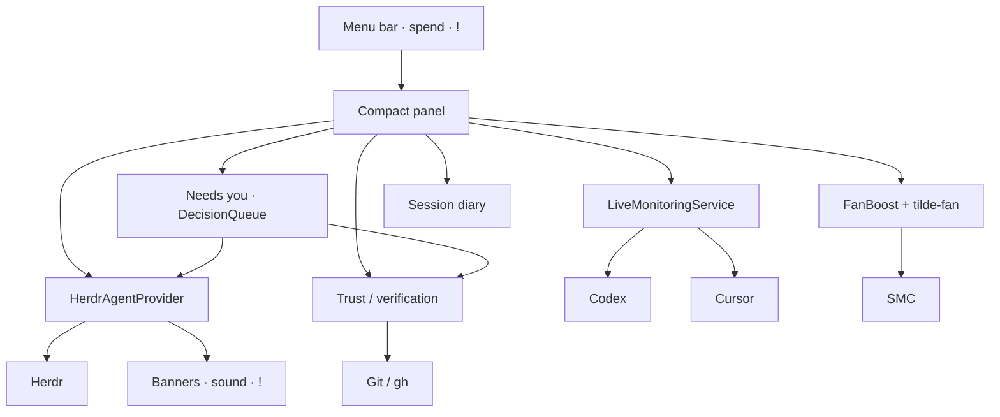

# Tilde

<p align="center">
  
</p>

<p align="center">
  <strong>Native macOS menu-bar command center</strong><br/>
  Machine health · AI agent attention · Change verification · Local recovery
</p>

<p align="center">
  
  
  
  
</p>

<p align="center">
  <a href="#quick-start">Quick start</a> ·
  <a href="#gallery">Gallery</a> ·
  <a href="#what-you-get">Features</a> ·
  <a href="#privacy">Privacy</a> ·
  <a href="#docs">Docs</a>
</p>

---

Tilde lives in your menu bar and answers four questions without stealing focus:

| | Question | What Tilde shows |
| ---: | --- | --- |
| **1** | What needs me? | **Needs you** decision card — one change, why it matters, one primary action |
| **2** | What changed? | Branch, dirty state, ahead/behind, project context |
| **3** | Is it safe? | Deterministic Git · exact verification · CI trust evidence |
| **4** | Where do I resume? | Private recovery capsule per project |

When an agent blocks or finishes a turn, Tilde also pings you: a `!` on the spend title, a short sound, and a native macOS side banner (when notifications are allowed).

Editors edit. Herdr runs agents. **Tilde is the ambient layer between them.**

## Gallery

Live captures from the running app, with project/agent identity and account-usage values replaced by demo stubs:

<p align="center">
  
</p>

<p align="center"><sub>Menu bar stays price-first — <code>!</code> appears when an agent needs attention</sub></p>

<p align="center">
  
</p>

<p align="center"><sub>Panel leads with Needs you, then agents, verification, and live machine health</sub></p>

<p align="center">
  
</p>

Re-capture anytime with:

```sh
./Scripts/capture-readme-assets.sh
```

Install / relaunch the menu-bar app with:

```sh
./Scripts/install-and-start.sh
```

## What you get

| Area | In the menu bar / panel |
| --- | --- |
| **Needs you** | Change-centered queue: one card per worktree, ranked reasons, Review / Run Checks / Open Agent |
| **Attention alerts** | Menu-bar `!`, local sound, and Notification Center banners when agents block or finish |
| **System HUD** | CPU sparkline, RAM pressure, disk, network, thermal slowdown alerts |
| **Fan Boost** | Real SMC fan control via `tilde-fan` (admin password once per login) |
| **AI spend** | Daily Cursor usage + Codex credit-equivalent estimate as the always-on menu title |
| **Agent attention** | Herdr inventory, blockers first, one-click focus back to the terminal |
| **Exact verification** | Explicit repository checks bound to the full Git fingerprint; stale immediately after a change |
| **Trust packet** | Deterministic Git / exact receipts / CI evidence — no opaque “AI confidence” |
| **Recovery** | Per-project capsule (metadata only) so you can resume cleanly |
| **Focus modes** | Ship · Meet · Battery presets |
| **Today diary** | Local JSONL of builds, focus, slowdowns, agent events |

## Quick start

**Needs:** macOS 14+ · Swift 6.1+  
Xcode is optional for SwiftPM runs; required for XCTest, signing, and distribution.

```sh
git clone https://github.com/Le0wang06/Tilde.git
cd Tilde
swift build
./Scripts/install-and-start.sh   # packages ~/Applications/Tilde.app + login item
```

| Command | What it does |
| --- | --- |
| `./Scripts/install-and-start.sh` | Build, install to `~/Applications/Tilde.app`, launch at login |
| `./Scripts/run-app.sh` | Build, package as `.app`, launch, register URL scheme |
| `swift run TildeDiagnostics` | Run without packaging |
| `swift run tilde-probe` | Non-GUI probe / feasibility report |
| `./Scripts/test.sh` | Calculation + state tests |

Allow **notifications** for Tilde in System Settings if you want side banners when agents finish or need input.

## Deep links

After `./Scripts/run-app.sh` or `./Scripts/install-and-start.sh`:

| URL | Action |
| --- | --- |
| `tilde://open` | Open main window |
| `tilde://refresh` | Force refresh |
| `tilde://copy-status` | Copy HUD summary |
| `tilde://open-cursor` | Launch Cursor |
| `tilde://focus/ship` | Ship mode |
| `tilde://focus/meet` | Meet mode |
| `tilde://focus/battery` | Battery mode |

```sh
open 'tilde://refresh'
```

## How it fits together



Sampling slows when the panel is closed. Manual refresh forces everything. Live system samples stay
**in memory**. To derive a daily value from Cursor's cumulative monetary meter, Tilde stores only
provider, local date, billing-period ID, and cent totals under Application Support.

<details>
<summary>Sampling intervals</summary>

| Metric | Visible | Background |
| --- | ---: | ---: |
| CPU / network | 1s | 5s |
| Memory / thermal | 2s | 10s |
| Battery | 15s | 60s |
| Storage | 60s | 5m |
| Codex | 60s | 2m |
| Cursor | 2m | 5m |
| Herdr agents | 2s (0.5s while working) | same |

</details>

## Privacy

Tilde is **local-first**. It does **not** store:

- prompts or chat transcripts  
- source code or diffs  
- terminal output  
- auth tokens or account email  

The daily-spend ledger stores monetary counters and observation timestamps only. Codex cost estimation
reads only local model and token-count events (input, cached input, and output); prompt and response
content is ignored and no Codex token data is persisted. `≈` marks a credit-equivalent estimate and a
trailing `+` marks a lower bound. Tilde never prices an undifferentiated token total or percentage.

Recovery capsules keep only path, branch, attention counts, verification state, and a next-action hint under Application Support.
Verification receipts keep only repository/worktree/profile/fingerprint hashes, Git object IDs, check
IDs and names, timestamps, durations, outcomes, and exit statuses. Command output remains ephemeral
and is never written to the receipt store.

The decision queue stores paths, branch names, reason text, and action metadata only.

## Exact verification profiles

Tilde never guesses or automatically runs repository commands. A repository can declare a reviewable
`.tilde/verify.json`; Tilde shows every command and requires an explicit **Trust & Run** click for that
repository and exact profile hash. Changing the profile requires trust again. After a run, **Clear &
Hide** deletes that worktree's stored receipt and hides the card until the fingerprint changes.

```json
{
  "version": 1,
  "base": "origin/main",
  "checks": [
    {
      "id": "tests",
      "name": "Tests",
      "command": "./Scripts/test.sh",
      "required": true,
      "timeoutSeconds": 900
    }
  ]
}
```

A receipt becomes stale when the base tip, merge base, `HEAD`, staged diff, unstaged diff, untracked
path/mode/size/content, dirty submodule state, or profile changes. Tilde requires two identical complete
fingerprint samples before using one, scopes receipts to the current worktree, and terminates the full
verification process group on cancellation or timeout.

## Repo layout

| Product | Role |
| --- | --- |
| `TildeDiagnostics` | Menu-bar app + diagnostics window |
| `tilde-probe` | CLI feasibility report |
| `tilde-fan` | Privileged fan daemon / CLI |
| `TildeCore` | Shared monitoring, agents, trust, decision queue, diary |

## Docs

- [AI Control Plane](Docs/AI-Control-Plane.md) — promise, shipped slice, next steps  
- [Phase 0 Feasibility](Docs/Phase-0-Feasibility.md) — measured results and limits  
- [Contribution workflow](AGENTS.md)

## Status

Phase 0 diagnostics are solid. Needs you, attention banners, and exact verification are in active dogfooding. Release gates: idle CPU, no notification spam on launch, low false blocked/done rates — details in the control-plane doc.

---

<p align="center">
  <sub>Built for people who already live in the menu bar.</sub><br/>
  <strong>~</strong>
</p>
