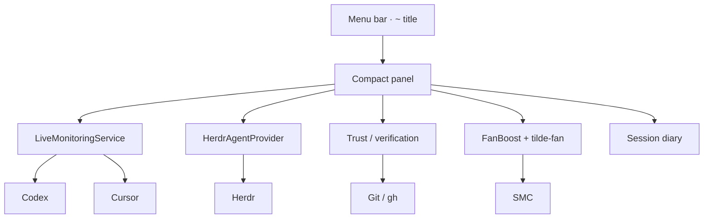

# ~

# Tilde

<p align="center">
  
  
  
</p>

<p align="center">
  <strong>A native macOS menu-bar command center</strong><br/>
  for machine health, AI agent attention, and change verification.
</p>

<p align="center">
  <a href="#quick-start"><strong>Quick start</strong></a> ·
  <a href="#what-you-get"><strong>What you get</strong></a> ·
  <a href="#deep-links"><strong>Deep links</strong></a> ·
  <a href="#privacy"><strong>Privacy</strong></a> ·
  <a href="#docs"><strong>Docs</strong></a>
</p>

---

## Why Tilde

Most tools either edit code or run agents. Tilde sits in between — always visible, never noisy — and answers four questions:

```text
  1  What needs me?     →  blocked / ready agents
  2  What changed?      →  project context + dirty state
  3  Is it safe?        →  Git · build · CI evidence
  4  Where do I resume? →  local recovery capsule
```

```text
┌─────────────────────────────────────────────────────────┐
│  ~  2 need you · Cx 67% · ⚒ · !                         │
└─────────────────────────────────────────────────────────┘
                          │ click
                          ▼
┌──────────────────────────────┐
│  CPU ████▁▂▃   RAM  41%      │
│  FAN  [boost]  DISK · NET    │
│  AI · CODEX ⇄ CURSOR         │
│  AGENTS · need you           │
│  Trust · Build · Project     │
│  FOCUS  Ship  Meet  Battery  │
└──────────────────────────────┘
```

Editors edit. Herdr runs agents. **Tilde is the ambient attention layer.**

## What you get

| Area | In the menu bar / panel |
| --- | --- |
| **System HUD** | CPU sparkline, RAM pressure, disk, network, thermal slowdown alerts |
| **Fan Boost** | Real SMC fan control via `tilde-fan` (admin password once per login) |
| **AI budget** | Codex ⇄ Cursor remaining % in one tap-to-cycle card |
| **Agent attention** | Herdr inventory, blockers first, one-click focus back to the terminal |
| **Trust packet** | Deterministic Git / build / CI evidence — no opaque “AI confidence” |
| **Recovery** | Per-project capsule (metadata only) so you can resume cleanly |
| **Focus modes** | Ship · Meet · Battery presets |
| **Today diary** | Local JSONL of builds, focus, slowdowns, agent events |

## Quick start

**Needs:** macOS 14+ · Swift 6.1+  
Xcode is optional for SwiftPM runs; required for XCTest, signing, and distribution.

```sh
git clone https://github.com/Le0wang06/Tilde.git
cd Tilde
swift build
./Scripts/run-app.sh     # wraps .app + registers tilde://
```

| Command | What it does |
| --- | --- |
| `./Scripts/run-app.sh` | Build, package as `.app`, launch, register URL scheme |
| `swift run TildeDiagnostics` | Run without packaging |
| `swift run tilde-probe` | Non-GUI probe / feasibility report |
| `./Scripts/test.sh` | Calculation + state tests |

## Deep links

After `./Scripts/run-app.sh`:

| URL | Action |
| --- | --- |
| `tilde://open` | Open main window |
| `tilde://refresh` | Force refresh |
| `tilde://copy-status` | Copy HUD summary |
| `tilde://open-cursor` | Launch Cursor |
| `tilde://focus/ship` | Ship mode |
| `tilde://focus/meet` | Meet mode |
| `tilde://focus/battery` | Battery mode |

```sh
open 'tilde://refresh'
```

## How it fits together



Sampling slows when the panel is closed. Manual refresh forces everything. Live samples stay **in memory** — not on disk.

<details>
<summary>Sampling intervals</summary>

| Metric | Visible | Background |
| --- | ---: | ---: |
| CPU / network | 1s | 5s |
| Memory / thermal | 2s | 10s |
| Battery | 15s | 60s |
| Storage | 60s | 5m |
| Codex | 60s | 2m |
| Cursor | 2m | 5m |
| Herdr agents | 2s | 2s |

</details>

## Privacy

Tilde is **local-first**. It does **not** store:

- prompts or chat transcripts  
- source code or diffs  
- terminal output  
- auth tokens or account email  

Recovery capsules keep only path, branch, attention counts, verification state, and a next-action hint under Application Support.

## Repo layout

| Product | Role |
| --- | --- |
| `TildeDiagnostics` | Menu-bar app + diagnostics window |
| `tilde-probe` | CLI feasibility report |
| `tilde-fan` | Privileged fan daemon / CLI |
| `TildeCore` | Shared monitoring, agents, trust, diary |

## Docs

- [AI Control Plane](Docs/AI-Control-Plane.md) — promise, shipped slice, next steps  
- [Phase 0 Feasibility](Docs/Phase-0-Feasibility.md) — measured results and limits  
- [Contribution workflow](AGENTS.md)

## Status

Phase 0 diagnostics are solid. The AI attention / verification slice is in active dogfooding. Release gates: idle CPU, no notification spam on launch, low false blocked/done rates — details in the control-plane doc.

---

<p align="center">
  <sub>Built for people who already live in the menu bar.</sub><br/>
  <strong>~</strong>
</p>
