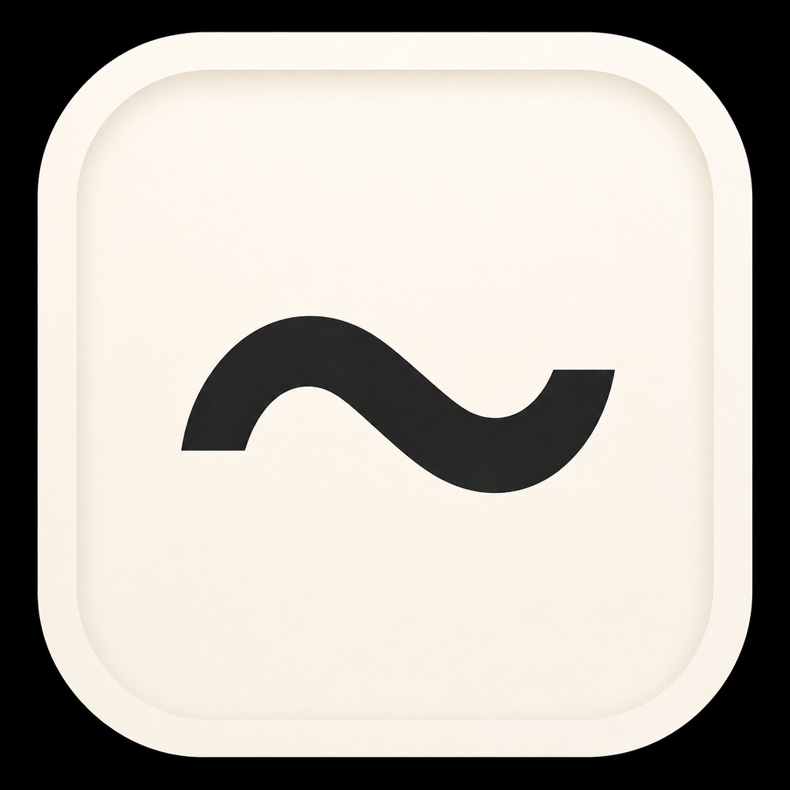

# Tilde

<p align="center">
  
</p>

<h1 align="center">Tilde</h1>

<p align="center">
  <strong>Your menu bar already knows the cost.<br/>Now it knows what needs you next.</strong>
</p>

<p align="center">
  Agents finish. Checks pass. Something blocks.<br/>
  Tilde surfaces the next human decision — with a sound, a <code>!</code>, and one clear action.
</p>

<p align="center">
  
  
  
</p>

<p align="center">
  <a href="#install"><strong>Install in 30 seconds ↓</strong></a>
  &nbsp;·&nbsp;
  <a href="#gallery">See it</a>
  &nbsp;·&nbsp;
  <a href="#privacy">Privacy</a>
</p>

<p align="center">
  
</p>

---

## The problem

You run agents all day. Between Cursor, Codex, builds, and CI, the scarce resource isn’t compute — it’s **attention**.

You keep reconstructing the same story: which worktree, is it blocked, did checks pass for *this* change, should you review or wait?

## What Tilde does

Tilde lives in the macOS menu bar and answers that in one glance:

| | |
| --- | --- |
| **Needs you** | One change. Why it matters. One primary action — Review, Run Checks, or Open Agent. |
| **Ping when it matters** | Menu-bar <code>!</code>, a short sound, and a native side banner when an agent blocks or finishes. |
| **Spend, always on** | Daily Cursor + Codex cost as the title — price-first, no clutter. |
| **Exact verification** | Repo-declared checks bound to the Git fingerprint. Stale the moment the change moves. |
| **Local-first** | No prompts, diffs, or terminal output leave your machine. |

Editors edit. Herdr runs agents. **Tilde is the ambient layer between them.**

## Gallery

<p align="center">
  
</p>

<p align="center"><sub>Price stays primary. <code>!</code> appears the moment something needs you.</sub></p>

<p align="center">
  
</p>

<p align="center"><sub>Real panel from the running app — Needs you, spend, limits, machine health, focus.</sub></p>

## Install

**macOS 14+ · Swift 6.1+**

```sh
git clone https://github.com/Le0wang06/Tilde.git
cd Tilde
./Scripts/install-and-start.sh
```

That builds Tilde, installs `~/Applications/Tilde.app`, and sets a login item. Allow **Notifications → Tilde** if you want side banners.

| Command | Purpose |
| --- | --- |
| `./Scripts/install-and-start.sh` | Install + launch |
| `./Scripts/test.sh` | Tests |
| `./Scripts/capture-readme-assets.sh` | Refresh gallery screenshots |
| `swift run tilde-probe` | CLI feasibility report |

### Deep links

`tilde://open` · `tilde://refresh` · `tilde://copy-status` · `tilde://open-cursor` · `tilde://focus/ship|meet|battery`

## More of what’s inside

| | |
| --- | --- |
| **System HUD** | CPU sparkline, RAM, disk, network, thermal slowdowns |
| **Fan Boost** | Real SMC control via `tilde-fan` |
| **Trust packet** | Deterministic Git / receipt / CI evidence |
| **Focus modes** | Ship · Meet · Battery |
| **Today diary** | Local JSONL of builds, focus, slowdowns, agent events |

## Privacy

**Local-first.** Tilde does **not** store prompts, diffs, terminal output, tokens, or account email.

Only metadata: spend counters, recovery hints, verification receipt hashes/outcomes, decision-queue paths/reasons, diary summaries.

## Exact verification

```json
{
  "version": 1,
  "base": "origin/main",
  "checks": [
    {
      "id": "tests",
      "name": "Tests",
      "command": "./Scripts/test.sh",
      "required": true,
      "timeoutSeconds": 900
    }
  ]
}
```

Declare checks in `.tilde/verify.json`. Tilde shows every command and requires **Trust & Run** for that repo + profile hash. Receipts go stale when the fingerprint moves.

## Docs

- [AI Control Plane](Docs/AI-Control-Plane.md)
- [Phase 0 Feasibility](Docs/Phase-0-Feasibility.md)
- [Contribution workflow](AGENTS.md)

---

<p align="center">
  <br/>
  <sub>Stop reconstructing. Start deciding.</sub>
</p>
