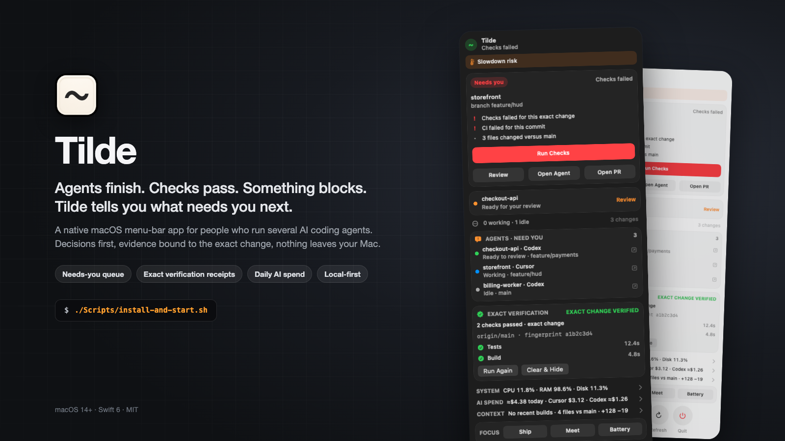
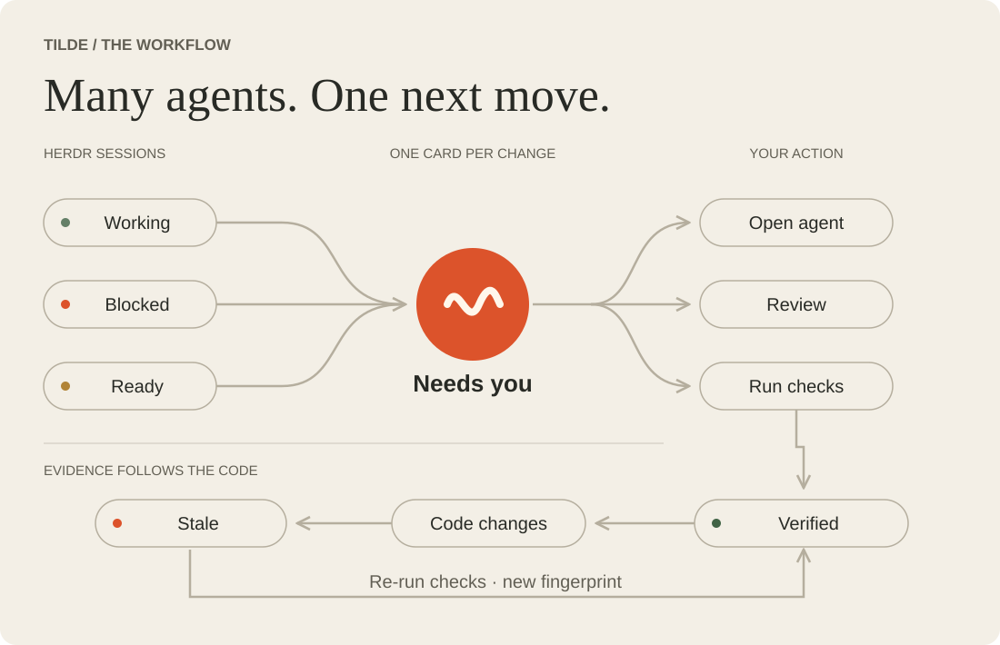
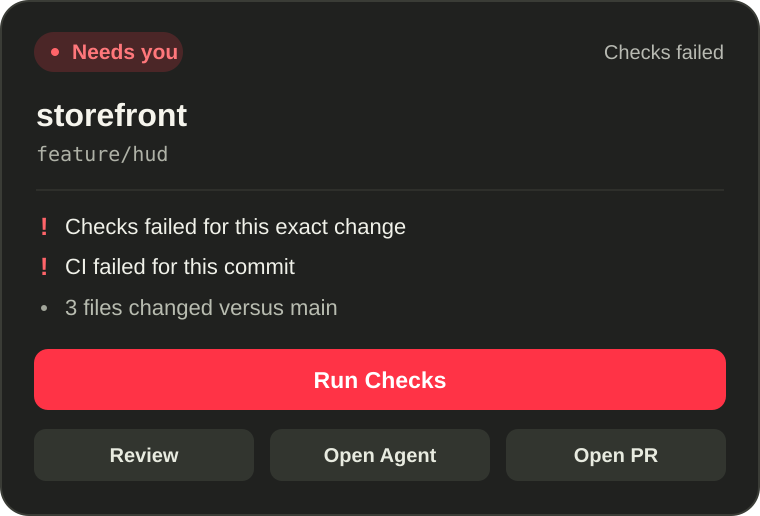
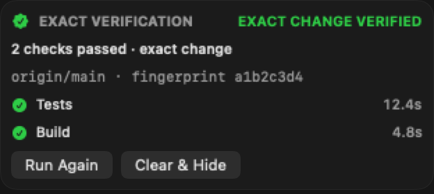
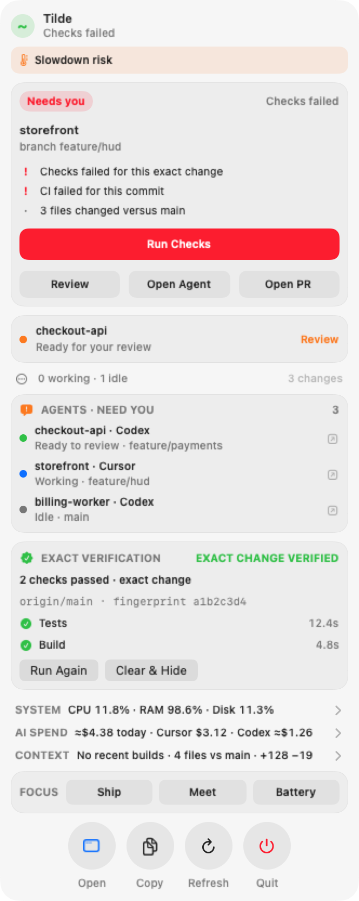
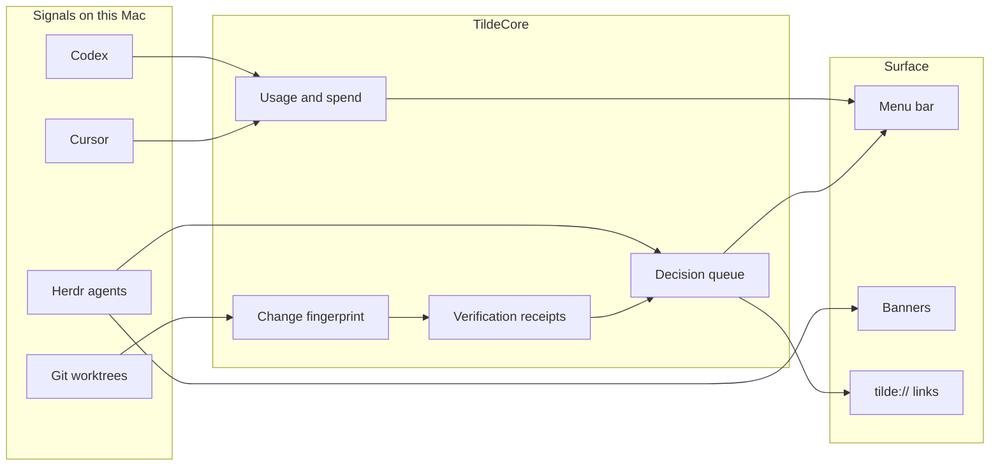

<p align="center">
  
</p>

<h1 align="center">Tilde</h1>

<p align="center">A native macOS menu bar for people who run AI coding agents.</p>

<p align="center">
  <a href="#install"><strong>Get Tilde for macOS ↗</strong></a>
  &nbsp; · &nbsp; <a href="#features">Take a look</a>
  &nbsp; · &nbsp; <a href="#install">Build it yourself</a>
  &nbsp; · &nbsp; <a href="#privacy">Privacy</a>
</p>

<p align="center">
  
</p>

<p align="center"><sub>Original app preview with demo data. Local-first refers to storage; provider usage requests still use the network.</sub></p>

You have agents working across repositories. One is blocked, another is ready for review, and the checks you ran before your last edit no longer describe the code in front of you.

**Tilde gives you a place to decide what happens next.** Open the menu bar, see the change that needs you, and jump back into the work. Leave the rest running.

<p align="center">
  <sub>macOS 14+ &nbsp; / &nbsp; Swift 6.1 &nbsp; / &nbsp; <a href="LICENSE">MIT licensed</a> &nbsp; / &nbsp; <a href="https://github.com/Le0wang06/Tilde/actions/workflows/ci.yml">Build status</a></sub>
</p>

## Features

<p align="center">
  <picture>
    <source media="(max-width: 600px)" srcset="Docs/assets/showcase/cover-mobile.svg" />
    
  </picture>
</p>

### Your attention has a queue now.

The **Needs you** view groups work around a change, with the reason it needs attention and one primary next action. Open the agent, inspect the change, or run its checks. Working and idle changes stay in a compact strip underneath.

<p align="center">
  
  <br/><sub>Decision-card illustration. See the full-panel screenshots below for the app itself.</sub>
</p>

Agent notifications happen on meaningful state transitions, after an initial silent baseline. A blocked or finished agent can bring you back to its session; unchanged polling does not keep announcing itself.

> Agent sessions and focus actions currently use **Herdr**. Verification, AI spend, and machine health also work without an agent runner.

### A green check should mean *this* code.

Run the checks declared in your repository’s `.tilde/verify.json`. Tilde records the outcome against a fingerprint of the change and verification profile. When a refreshed fingerprint differs, the old receipt becomes **stale**.

**Verified → edit → stale → re-run.** A new commit, a working-tree edit, or a changed profile requires new evidence. Commands are shown before you trust and run them; a passing receipt is evidence for the declared checks, not a guarantee that the change is correct.

<details>
<summary>See the verification receipt</summary>

<p align="center">
  
</p>

</details>

### The rest stays within reach.

**Cost, without another dashboard.** Today’s observed Cursor spend and estimated Codex spend live in the menu bar. Open AI SPEND for the Codex 5-hour and 7-day windows and their reset times, when available.

**Machine health, one line away.** CPU, memory pressure, disk, network, and fan controls stay in a collapsed system section until you need them.

**A first run with a next step.** Setup guides you through opening a repository, connecting an agent runner, and adding a verification profile. Copy starter gives you a profile to start from.

<details>
<summary><strong>Explore the full panel · light and dark</strong></summary>

<p align="center">
  <picture>
    <source media="(prefers-color-scheme: dark)" srcset="Docs/assets/tilde-panel-dark.png" />
    
  </picture>
</p>

[Light appearance](Docs/assets/tilde-panel-light.png) · [Dark appearance](Docs/assets/tilde-panel-dark.png) · [Expanded sections](Docs/assets/tilde-panel-dark-expanded.png) · [First run](Docs/assets/tilde-panel-first-run.png)

</details>

<sub>App screenshots show illustrative demo data. Availability depends on connected providers and your Mac.</sub>

---

## Install

### Build from source

```sh
git clone https://github.com/Le0wang06/Tilde.git
cd Tilde
./Scripts/install-and-start.sh
```

That builds with SwiftPM, wraps `~/Applications/Tilde.app`, registers a login LaunchAgent, and opens it. Requires the Swift 6.1 toolchain; Command Line Tools are enough, Xcode is optional.

<details>
<summary>Release archives and first launch</summary>

There is no published GitHub release yet; build from source above. When an archive is available on the [releases page](https://github.com/Le0wang06/Tilde/releases), unzip it and move `Tilde.app` to `~/Applications` or `/Applications`.

Packaged builds are signed ad hoc, not notarized. On first launch, right-click the app and choose **Open**.

</details>

### Uninstall

```sh
./Scripts/uninstall.sh            # stop the LaunchAgent, remove ~/Applications/Tilde.app
./Scripts/uninstall.sh --purge    # also remove ~/Library/Application Support/Tilde
```

**Requirements:** macOS 14 Sonoma or later, Apple Silicon (Intel builds are untested). Agent cards need [Herdr](#faq); spend, system, and verification work without it.

<br/>

## How it works


```mermaid
flowchart LR
  subgraph sources [Signals on this Mac]
    H[Herdr agents]
    C[Codex]
    K[Cursor]
    G[Git worktrees]
  end
  subgraph core [TildeCore]
    F[Change fingerprint]
    V[Verification receipts]
    Q[Decision queue]
    U[Usage and spend]
  end
  subgraph surface [Surface]
    M[Menu bar]
    B[Banners]
    D[tilde:// links]
  end
  H --> Q
  C --> U
  K --> U
  U --> M
  G --> F --> V --> Q
  Q --> M
  H --> B
  Q --> D
```

| Idea | What it means in practice |
| --- | --- |
| **Change fingerprint** | SHA-256 over `HEAD`, the merge-base against the profile's base ref, staged and unstaged diffs, untracked file contents, submodule state, and the profile hash. |
| **Receipts that go stale** | A receipt is valid only for the fingerprint it was collected against. A refreshed fingerprint marks outdated evidence stale. |
| **Trust on first use** | Commands come from the repository's `.tilde/verify.json`, are shown verbatim, and run only after you click Trust & Run for that repository and profile hash. |
| **Needs-you ranking** | Blocked agent, then failed or missing verification, then ready-but-unverified, then verified and ready for review. |

<details>
<summary><strong>Configure repository checks and understand receipt states</strong></summary>

### Verification profile

Declare the checks a repository trusts in `.tilde/verify.json`. Tilde verifies itself with this file:

```json
{
  "version": 1,
  "base": "origin/main",
  "checks": [
    { "id": "tests", "name": "Tests", "command": "./Scripts/test.sh", "required": true, "timeoutSeconds": 900 },
    { "id": "build", "name": "Build", "command": "swift build", "required": true, "timeoutSeconds": 600 }
  ]
}
```

| State | Meaning |
| --- | --- |
| `unconfigured` | No `.tilde/verify.json` in this repository. |
| `missing` | Checks are declared but have not run for this fingerprint. |
| `running` | A check you started is still running. |
| `failed` | One or more required checks exited non-zero. |
| `partial` | Some required evidence is missing or unavailable. |
| `verified` | Every required check passed for this exact fingerprint. |
| `stale` | The fingerprint changed after the evidence was collected. |

Check output is shown while a check runs and is never persisted. Clean, low risk, and verified are separate facts and are labeled separately.

</details>

<br/>

## Usage

**Menu bar.** The title combines observed Cursor spend and estimated Codex spend for today, for example `≈$4.38`. Agent attention adds `!` to the title. Agent-state transitions can trigger a banner when notifications are permitted; verification failures are visible in the decision queue.

**Panel.** Needs-you cards, then the agents list and verification receipt, then SYSTEM, AI SPEND, and CONTEXT as one-line summaries that expand on click. Focus modes and Open, Copy, Refresh, Quit sit at the bottom.

**Focus modes** are fan presets applied through `tilde-fan`: Ship boosts fans for long builds, Meet quiets fans and closes Slack and Discord, Battery turns fans off.

**Deep links** work from any launcher, script, or terminal:

| Link | Action |
| --- | --- |
| `tilde://open` | Open the full diagnostics window |
| `tilde://refresh` | Refresh all providers now |
| `tilde://copy-status` | Copy the status summary |
| `tilde://open-cursor` | Open Cursor |
| `tilde://focus/ship`, `meet`, `battery`, `off` | Switch focus mode |

**Command line.** `swift run tilde-probe` prints a feasibility report for this Mac; `./Scripts/run-app.sh` runs a build without installing it.

<br/>

## Privacy

Tilde is local-first. It does **not** store prompts, diffs, terminal output, source code, authentication tokens, or account email. Cursor credentials are read locally and used in memory to request membership and usage information directly from Cursor over HTTPS. Codex usage is read through its local app server; Herdr output is reduced to agent state. Local-first describes Tilde’s storage model, not an absence of provider network requests.

Everything Tilde keeps lives in `~/Library/Application Support/Tilde`: spend counters, verification receipts (check ids, command hashes, outcomes, timestamps, fingerprints), trusted profile hashes, decision-queue entries, diary summaries, and recovery hints. Every pull request that writes a new value to disk must say so under "Privacy impact". Remove it all with `./Scripts/uninstall.sh --purge`.

<br/>

## FAQ

**No agents are shown.** Tilde reads agent state from Herdr. Install Herdr and start an agent; the Get set up checklist clears once the runner is connected.

**Cursor spend is missing.** Sign in to Cursor on this Mac. Tilde reads credentials from Cursor’s local state store and requests membership and usage directly from Cursor.

**Codex windows say unavailable.** The Codex app server is not reachable or has not reported a window yet. Tilde labels what it cannot measure instead of guessing.

**macOS says the app is from an unidentified developer.** Releases are signed ad hoc, not notarized. Right-click `Tilde.app` and choose Open once, or run `xattr -d com.apple.quarantine ~/Applications/Tilde.app`.

**Notifications never appear.** Grant permission under System Settings, Notifications, Tilde. The app briefly appears in the Dock to ask, then returns to the menu bar.

**Fan Boost asks for a password.** Real SMC fan control runs through a small privileged daemon. macOS asks once per login.

**Is the trust label proof?** No. From the [product study](Docs/Tilde-Usefulness-Study.md): "Tilde's current `Trust` label is not yet strong enough to be called trust." Only a verification receipt for the exact fingerprint counts as evidence.

<br/>

## Roadmap

Tilde is at v0.2 and is dogfooded daily by its author. The [usefulness study](Docs/Tilde-Usefulness-Study.md#phased-roadmap) sets the order:

- [x] **Exact local receipts.** One click produces a durable receipt for the exact local change.
- [x] **Change-centered queue.** One card per change across all worktrees, ranked by what needs you.
- [ ] **Risk and scope.** Deterministic path categories, out-of-scope flags, a copyable Markdown receipt for pull requests.
- [ ] **Conflict radar.** Read-only `git merge-tree` simulation across active worktrees before merge.
- [ ] **Provider adapters.** Supported Codex, Claude Code, and Cursor integrations alongside Herdr, each labeled exact, inferred, or unavailable.
- [ ] **Signed, notarized releases** and a Homebrew cask.

See the [CHANGELOG](CHANGELOG.md) for what shipped in each version.

<br/>

## Contributing

Read [CONTRIBUTING.md](CONTRIBUTING.md) for the build, layout, privacy rule, and branch workflow. Pull requests use the [template](.github/PULL_REQUEST_TEMPLATE.md); bugs and ideas go through the issue forms. Security reports follow [SECURITY.md](SECURITY.md).

```sh
./Scripts/test.sh          # swift-testing suite
./Scripts/package-app.sh   # dist/Tilde.app + versioned zip, same as the Release workflow
```

## License

[MIT](LICENSE). Copyright 2026 Leo Wang.

---

<p align="center">
  <br/>
  <sub>Stop reconstructing. Start deciding.</sub>
</p>
