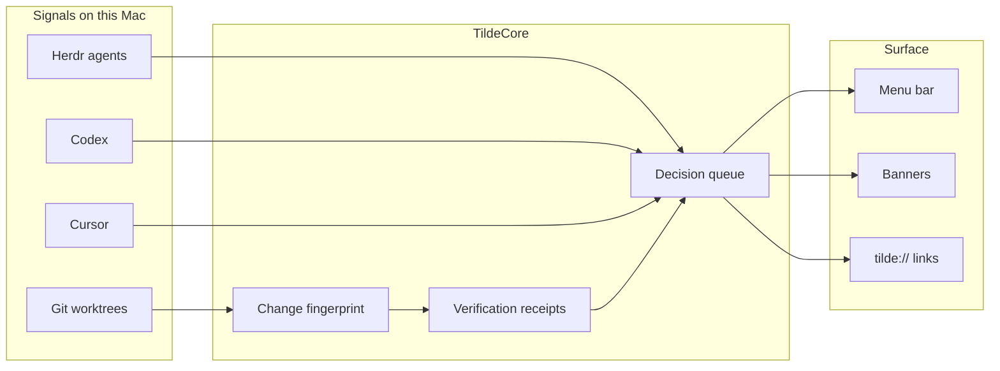

<p align="center">
  
</p>

<h1 align="center">Tilde</h1>

<p align="center">
  <strong>The menu bar for people who run AI coding agents.</strong><br/>
  Agents finish. Checks pass. Something blocks. Tilde tells you what needs you next.
</p>

<p align="center">
  <a href="https://github.com/Le0wang06/Tilde/releases/latest"></a>
  <a href="https://github.com/Le0wang06/Tilde/actions/workflows/ci.yml"></a>
  
  
  <a href="LICENSE"></a>
</p>

<p align="center">
  <a href="https://github.com/Le0wang06/Tilde/releases/latest"><strong>Download for macOS</strong></a>
  &nbsp;·&nbsp;
  <a href="#install">Install</a>
  &nbsp;·&nbsp;
  <a href="#features">Features</a>
  &nbsp;·&nbsp;
  <a href="#how-it-works">How it works</a>
  &nbsp;·&nbsp;
  <a href="#privacy">Privacy</a>
  &nbsp;·&nbsp;
  <a href="#faq">FAQ</a>
</p>

<p align="center">
  
</p>

<br/>

Run Codex, Cursor, and Claude Code in parallel and the scarce resource is no longer compute. It is your attention. Tilde lives in the macOS menu bar and answers one question at a glance: **which change needs a human decision right now, and is the evidence for it still valid?**

- **Decisions first.** One card per change, ranked by what needs you. Blocked agents outrank failed checks, which outrank ready-for-review.
- **Evidence you can trust.** Test and build receipts are bound to a SHA-256 fingerprint of the exact change and go stale the moment the tree moves.
- **Nothing leaves your Mac.** No prompts, diffs, terminal output, tokens, or account email are ever stored. Metadata only.

<br/>

## Install

### Download

1. Grab `Tilde-x.y.z.zip` from the [latest release](https://github.com/Le0wang06/Tilde/releases/latest) and unzip it.
2. Move `Tilde.app` to `~/Applications` (or `/Applications`).
3. First launch: right-click the app and choose **Open**. The build is signed ad hoc, not notarized, so macOS asks once.

### Build from source

```sh
git clone https://github.com/Le0wang06/Tilde.git
cd Tilde
./Scripts/install-and-start.sh
```

That builds with SwiftPM, wraps `~/Applications/Tilde.app`, registers a login LaunchAgent, and opens it. Requires the Swift 6 toolchain; Command Line Tools are enough, Xcode is optional.

### Uninstall

```sh
./Scripts/uninstall.sh            # stop the LaunchAgent, remove ~/Applications/Tilde.app
./Scripts/uninstall.sh --purge    # also remove ~/Library/Application Support/Tilde
```

**Requirements:** macOS 14 Sonoma or later, Apple Silicon (Intel builds are untested). Agent cards need [Herdr](#faq); spend, system, and verification work without it.

<br/>

## Features

<table>
  <tr>
    <td width="50%" valign="top">
      
      <h3>Needs you</h3>
      <p>One card per change, not per process. Why it needs you, one primary action, secondary actions a tap away. Everything else collapses into a single working and idle strip.</p>
    </td>
    <td width="50%" valign="top">
      
      <h3>Exact verification</h3>
      <p>Run the repository's own checks and get a receipt keyed to the change fingerprint. A new commit, a saved file, or an edited profile marks it stale until you run again.</p>
    </td>
  </tr>
  <tr>
    <td width="50%" valign="top">
      
      <h3>Agents at a glance</h3>
      <p>Every Herdr session with its state and branch. Native banners with sound fire on transitions only, so idle monitoring never interrupts. Click to focus the agent.</p>
    </td>
    <td width="50%" valign="top">
      
      <h3>AI spend, always on</h3>
      <p>Today's Cursor and Codex cost as the menu bar title, with the 5-hour and 7-day Codex windows and their reset times one click away.</p>
    </td>
  </tr>
  <tr>
    <td width="50%" valign="top">
      
      <h3>Machine health, out of the way</h3>
      <p>CPU sparkline, memory pressure, disk, network, and real SMC fan control. Collapsed to one line by default so the panel fits without scrolling.</p>
    </td>
    <td width="50%" valign="top">
      
      <h3>Guided first run</h3>
      <p>A checklist stays until a repository is open, an agent runner is connected, and a verification profile exists. Copy starter puts a working profile on the clipboard.</p>
    </td>
  </tr>
</table>

<details>
<summary><strong>More screenshots</strong></summary>
<br/>
<p align="center">
  
</p>
<table>
  <tr>
    <td align="center" width="33%"><br/><sub>Default, dark</sub></td>
    <td align="center" width="33%"><br/><sub>Default, light</sub></td>
    <td align="center" width="33%"><br/><sub>All sections expanded</sub></td>
  </tr>
</table>
</details>

<br/>

## How it works


```mermaid
flowchart LR
  subgraph sources [Signals on this Mac]
    H[Herdr agents]
    C[Codex]
    K[Cursor]
    G[Git worktrees]
  end
  subgraph core [TildeCore]
    F[Change fingerprint]
    V[Verification receipts]
    Q[Decision queue]
  end
  subgraph surface [Surface]
    M[Menu bar]
    B[Banners]
    D[tilde:// links]
  end
  H --> Q
  C --> Q
  K --> Q
  G --> F --> V --> Q
  Q --> M
  Q --> B
  Q --> D
```

| Idea | What it means in practice |
| --- | --- |
| **Change fingerprint** | SHA-256 over `HEAD`, the merge-base against the profile's base ref, staged and unstaged diffs, untracked file contents, submodule state, and the profile hash. |
| **Receipts that go stale** | A receipt is valid only for the fingerprint it was collected against. Move the tree and the card says so. |
| **Trust on first use** | Commands come from the repository's `.tilde/verify.json`, are shown verbatim, and run only after you click Trust & Run for that repository and profile hash. |
| **Needs-you ranking** | Blocked agent, then failed or missing verification, then ready-but-unverified, then verified and ready for review. |

### Verification profile

Declare the checks a repository trusts in `.tilde/verify.json`. Tilde verifies itself with this file:

```json
{
  "version": 1,
  "base": "origin/main",
  "checks": [
    { "id": "tests", "name": "Tests", "command": "./Scripts/test.sh", "required": true, "timeoutSeconds": 900 },
    { "id": "build", "name": "Build", "command": "swift build", "required": true, "timeoutSeconds": 600 }
  ]
}
```

| State | Meaning |
| --- | --- |
| `unconfigured` | No `.tilde/verify.json` in this repository. |
| `missing` | Checks are declared but have not run for this fingerprint. |
| `running` | A check you started is still running. |
| `failed` | One or more required checks exited non-zero. |
| `partial` | Some required evidence is missing or unavailable. |
| `verified` | Every required check passed for this exact fingerprint. |
| `stale` | The fingerprint changed after the evidence was collected. |

Check output is shown while a check runs and is never persisted. Clean, low risk, and verified are separate facts and are labeled separately.

<br/>

## Usage

**Menu bar.** The title is today's estimated AI spend, for example `≈$4.38`. When a change needs a decision it becomes `! ≈$4.38` and a banner posts once.

**Panel.** Needs-you cards, then the agents list and verification receipt, then SYSTEM, AI SPEND, and CONTEXT as one-line summaries that expand on click. Focus modes and Open, Copy, Refresh, Quit sit at the bottom.

**Focus modes** are fan presets applied through `tilde-fan`: Ship boosts fans for long builds, Meet quiets fans and closes Slack and Discord, Battery turns fans off.

**Deep links** work from any launcher, script, or terminal:

| Link | Action |
| --- | --- |
| `tilde://open` | Open the full diagnostics window |
| `tilde://refresh` | Refresh all providers now |
| `tilde://copy-status` | Copy the status summary |
| `tilde://open-cursor` | Open Cursor |
| `tilde://focus/ship`, `meet`, `battery`, `off` | Switch focus mode |

**Command line.** `swift run tilde-probe` prints a feasibility report for this Mac; `./Scripts/run-app.sh` runs a build without installing it.

<br/>

## Privacy

Tilde is local-first. It does **not** store prompts, diffs, terminal output, source code, authentication tokens, or account email. The Cursor token is read into memory for one request and discarded; Codex app-server output is parsed for token counts only; Herdr output is reduced to agent state.

Everything Tilde keeps lives in `~/Library/Application Support/Tilde`: spend counters, verification receipts (check ids, command hashes, outcomes, timestamps, fingerprints), trusted profile hashes, decision-queue entries, diary summaries, and recovery hints. Every pull request that writes a new value to disk must say so under "Privacy impact". Remove it all with `./Scripts/uninstall.sh --purge`.

<br/>

## FAQ

**No agents are shown.** Tilde reads agent state from Herdr. Install Herdr and start an agent; the Get set up checklist clears once the runner is connected.

**Cursor spend is missing.** Sign in to Cursor on this Mac. Tilde reads the local plan through Cursor's own state store.

**Codex windows say unavailable.** The Codex app server is not reachable or has not reported a window yet. Tilde labels what it cannot measure instead of guessing.

**macOS says the app is from an unidentified developer.** Releases are signed ad hoc, not notarized. Right-click `Tilde.app` and choose Open once, or run `xattr -d com.apple.quarantine ~/Applications/Tilde.app`.

**Notifications never appear.** Grant permission under System Settings, Notifications, Tilde. The app briefly appears in the Dock to ask, then returns to the menu bar.

**Fan Boost asks for a password.** Real SMC fan control runs through a small privileged daemon. macOS asks once per login.

**Is the trust label proof?** No. From the [product study](Docs/Tilde-Usefulness-Study.md): "Tilde's current `Trust` label is not yet strong enough to be called trust." Only a verification receipt for the exact fingerprint counts as evidence.

<br/>

## Roadmap

Tilde is at v0.2 and is dogfooded daily by its author. The [usefulness study](Docs/Tilde-Usefulness-Study.md#phased-roadmap) sets the order:

- [x] **Exact local receipts.** One click produces a durable receipt for the exact local change.
- [x] **Change-centered queue.** One card per change across all worktrees, ranked by what needs you.
- [ ] **Risk and scope.** Deterministic path categories, out-of-scope flags, a copyable Markdown receipt for pull requests.
- [ ] **Conflict radar.** Read-only `git merge-tree` simulation across active worktrees before merge.
- [ ] **Provider adapters.** Supported Codex, Claude Code, and Cursor integrations alongside Herdr, each labeled exact, inferred, or unavailable.
- [ ] **Signed, notarized releases** and a Homebrew cask.

See the [CHANGELOG](CHANGELOG.md) for what shipped in each version.

<br/>

## Contributing

Read [CONTRIBUTING.md](CONTRIBUTING.md) for the build, layout, privacy rule, and branch workflow. Pull requests use the [template](.github/PULL_REQUEST_TEMPLATE.md); bugs and ideas go through the issue forms. Security reports follow [SECURITY.md](SECURITY.md).

```sh
./Scripts/test.sh          # swift-testing suite
./Scripts/package-app.sh   # dist/Tilde.app + versioned zip, same as the Release workflow
```

## License

[MIT](LICENSE). Copyright 2026 Leo Wang.

---

<p align="center">
  <br/>
  <sub>Stop reconstructing. Start deciding.</sub>
</p>
