<p align="center">
  
</p>

<h1 align="center">Tilde</h1>

<p align="center">
  <strong>Agents finish. Checks pass. Something blocks.<br/>Tilde tells you what needs you next.</strong>
</p>

<p align="center">
  <a href="https://github.com/Le0wang06/Tilde/actions/workflows/ci.yml"></a>
  
  
  <a href="LICENSE"></a>
  
</p>

<p align="center">
  <a href="#install-in-30-seconds">Install</a>
  &nbsp;·&nbsp;
  <a href="#how-it-works">How it works</a>
  &nbsp;·&nbsp;
  <a href="#privacy">Privacy</a>
  &nbsp;·&nbsp;
  <a href="#faq-and-troubleshooting">FAQ</a>
</p>

<p align="center">
  
</p>

Tilde is a macOS menu bar app for developers who run several AI coding agents at once. It keeps the change, not the agent, as the durable object: which worktree needs a decision, what evidence backs it, and whether that evidence is still valid for the code as it sits right now.

## Why

| Attention is the bottleneck | Evidence goes stale | Nothing leaves your machine |
| --- | --- | --- |
| Two or three agents across worktrees generate changes faster than one person can triage them. The scarce resource is your judgment, so Tilde shows only the change that needs it next and one action to take. | "Tests passed" means nothing unless you know which exact commit, staged edit, and untracked file it covered. Tilde binds every receipt to a change fingerprint and marks it stale the moment the tree moves. | Tilde reads Git, Herdr, Codex, and Cursor locally. It never stores prompts, diffs, terminal output, tokens, or account email. Metadata only, in Application Support. |

## Install in 30 seconds

```sh
git clone https://github.com/Le0wang06/Tilde.git
cd Tilde
./Scripts/install-and-start.sh
```

That builds `TildeDiagnostics` with SwiftPM, wraps it as `~/Applications/Tilde.app`, registers a login LaunchAgent, and opens it. Tilde appears in the menu bar as today's AI spend.

**Requirements:** macOS 14 or later, Apple Silicon (Intel builds are untested), Swift 6.1 toolchain (`swift --version`). Xcode is optional: Command Line Tools are enough to build, test, and run. Xcode is needed only for signing and distribution. There are no external package dependencies.

**Notifications:** the first time an agent blocks or finishes, Tilde asks for permission to post banners with sound. Allow it under System Settings, Notifications, Tilde. Banners are transition-only, so idle monitoring never posts.

**Uninstall:**

```sh
./Scripts/uninstall.sh            # stop the LaunchAgent, remove ~/Applications/Tilde.app
./Scripts/uninstall.sh --purge    # also remove ~/Library/Application Support/Tilde
```

## What you see

<p align="center">
  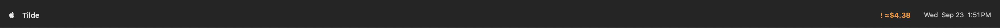
</p>

<table>
  <tr>
    <td align="center" width="50%">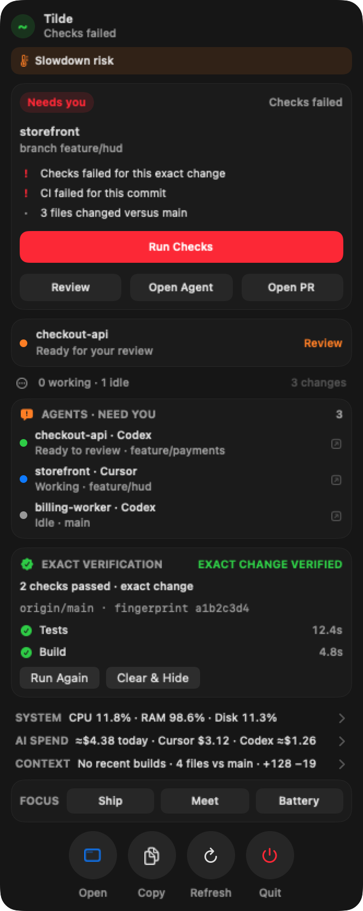<br/><sub><strong>Default panel, dark.</strong> A Needs you card with one primary action, the working and idle strip, and SYSTEM, AI SPEND, and CONTEXT collapsed to one-line summaries.</sub></td>
    <td align="center" width="50%"><br/><sub><strong>Light mode.</strong> The same panel following the system appearance.</sub></td>
  </tr>
  <tr>
    <td align="center" width="50%">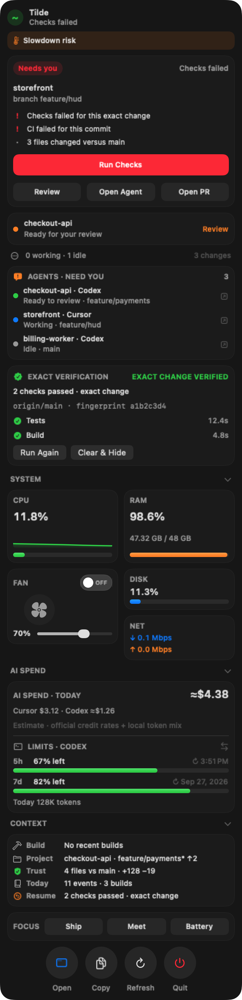<br/><sub><strong>Expanded.</strong> CPU, memory, storage, fan, and network detail; Codex and Cursor allowances; build, project, trust, and diary context; the verification receipt above.</sub></td>
    <td align="center" width="50%">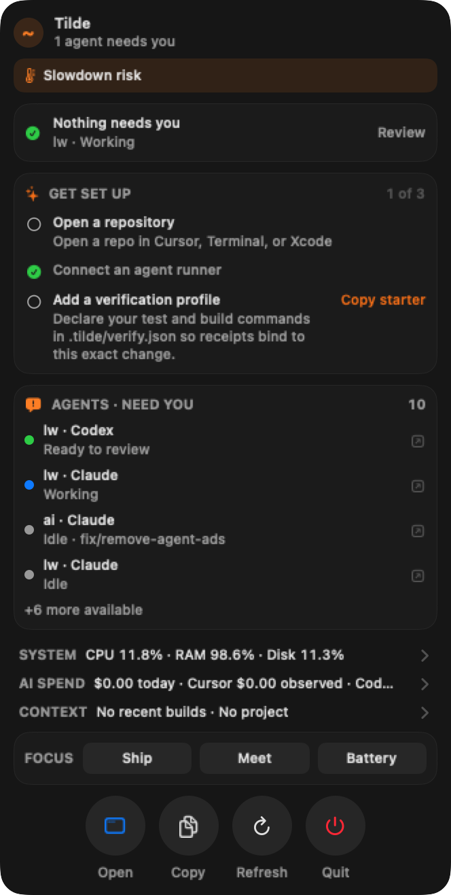<br/><sub><strong>First run.</strong> A Get set up checklist stays until a repository is open, an agent runner (Herdr) is connected, and a <code>.tilde/verify.json</code> profile exists. Copy starter puts a starter profile on the clipboard.</sub></td>
  </tr>
</table>

Panel footer: Open (full diagnostics window), Copy (status summary to the clipboard), Refresh, Quit. Focus modes Ship, Meet, and Battery sit above it.

### Features up close

<table>
  <tr>
    <td align="center" width="50%">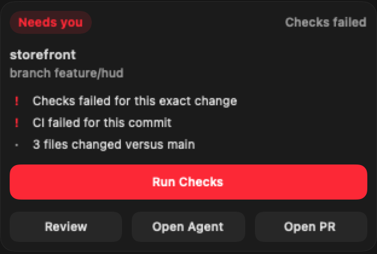<br/><sub><strong>Needs you.</strong> One card per change: why it needs you, one primary action, the rest secondary.</sub></td>
    <td align="center" width="50%"><br/><sub><strong>Exact verification.</strong> Receipts keyed to the change fingerprint; stale the moment the tree moves.</sub></td>
  </tr>
  <tr>
    <td align="center" width="50%">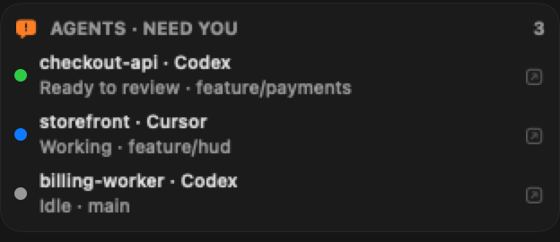<br/><sub><strong>Agents.</strong> Every Herdr session with its state and branch; click to focus it.</sub></td>
    <td align="center" width="50%">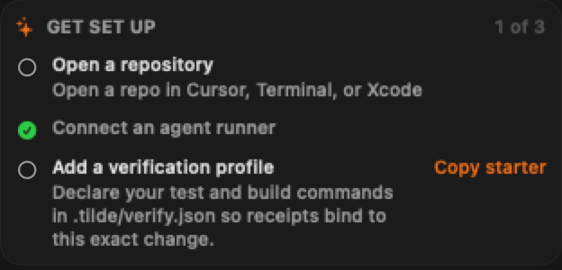<br/><sub><strong>Get set up.</strong> A checklist until a repository, an agent runner, and a verification profile exist.</sub></td>
  </tr>
  <tr>
    <td align="center" width="50%">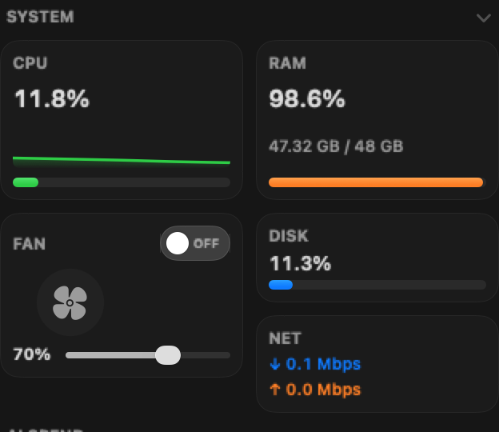<br/><sub><strong>System.</strong> CPU sparkline, memory pressure, real SMC fan boost, disk, and network. Collapsed to one line by default.</sub></td>
    <td align="center" width="50%">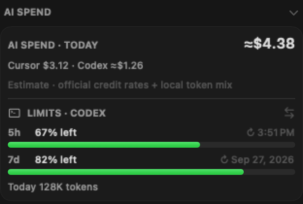<br/><sub><strong>AI spend.</strong> Today's Cursor and Codex cost with the 5-hour and 7-day Codex windows and reset times.</sub></td>
  </tr>
  <tr>
    <td align="center" width="50%" colspan="2">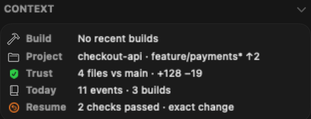<br/><sub><strong>Context.</strong> Build, project, trust, today's diary, and where to resume.</sub></td>
  </tr>
</table>

## How it works

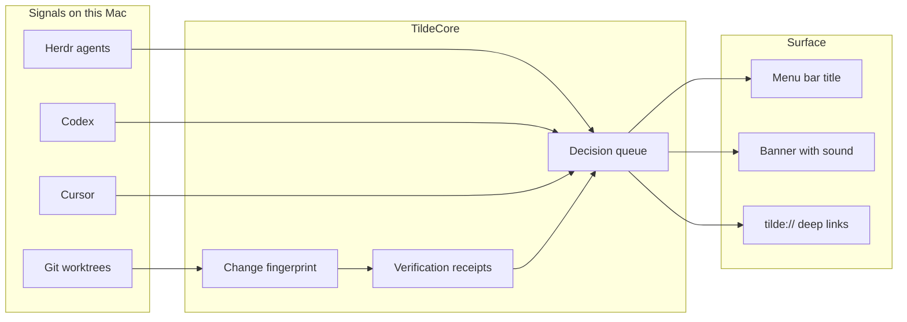
```mermaid
flowchart LR
  subgraph sources [Signals on this Mac]
    H[Herdr agents]
    C[Codex]
    K[Cursor]
    G[Git worktrees]
  end
  subgraph core [TildeCore]
    Q[Decision queue]
    V[Verification receipts]
    F[Change fingerprint]
  end
  subgraph surface [Surface]
    M[Menu bar title]
    B[Banner with sound]
    D[tilde:// deep links]
  end
  H --> Q
  C --> Q
  K --> Q
  G --> F
  F --> V
  V --> Q
  Q --> M
  Q --> B
  Q --> D
```

Core ideas, each one deterministic:

- **Change fingerprint.** SHA-256 over `HEAD`, the merge-base against the profile's base ref, the staged diff, the unstaged diff, untracked file contents, submodule state, and the profile hash. Every receipt is keyed to this value.
- **Receipts that go stale.** A receipt is valid only for the fingerprint it was collected against. A new commit, a saved file, or an edited profile moves the fingerprint and the receipt is marked stale until you run again.
- **Trust on first use.** Commands come from the repository's `.tilde/verify.json`, are shown verbatim, and run only after you click Trust & Run for that repository and profile hash. Editing the profile changes the hash and requires re-trusting.
- **Needs-you ranking.** One card per change, not per process. Blocked agents rank first, then failed or missing verification, then ready-but-unverified, then verified and ready for review. Working and idle agents collapse into a single strip.

## Exact verification

Declare the checks a repository trusts in `.tilde/verify.json`. This is Tilde's own profile:

```json
{
  "version": 1,
  "base": "origin/main",
  "checks": [
    {
      "id": "tests",
      "name": "Tests",
      "command": "./Scripts/test.sh",
      "required": true,
      "timeoutSeconds": 900
    },
    {
      "id": "build",
      "name": "Build",
      "command": "swift build",
      "required": true,
      "timeoutSeconds": 600
    }
  ]
}
```

The file must be a regular file, not a symlink. `version` must be `1`, at least one check must be `required`, ids are unique, and `timeoutSeconds` is between 1 and 3600. Check output is shown while a check runs and is not persisted; the receipt keeps the check id, command hash, exit status, duration, timestamps, and fingerprint.

| State | Meaning |
| --- | --- |
| `unconfigured` | No `.tilde/verify.json` in this repository. |
| `missing` | Checks are declared but have not run for this fingerprint. |
| `running` | A check you started is still running. |
| `failed` | One or more required checks exited non-zero. |
| `partial` | Some required evidence is missing or unavailable. |
| `verified` | Every required check passed for this exact fingerprint. |
| `stale` | The fingerprint changed after the evidence was collected. |

Clean, low risk, and verified are separate facts and are labeled separately.

## Menu bar and deep links

The menu bar title is today's estimated AI spend (Codex from local token classes, Cursor from the local plan), for example `≈$4.38`. When a change needs a decision the title becomes `! ≈$4.38` and a banner posts once for the transition.

Deep links work from any launcher, script, or terminal:

| Link | Action |
| --- | --- |
| `tilde://open` | Open the full diagnostics window |
| `tilde://refresh` | Refresh all providers now |
| `tilde://copy-status` | Copy the status summary to the clipboard |
| `tilde://open-cursor` | Open Cursor |
| `tilde://focus/ship` | Focus mode Ship |
| `tilde://focus/meet` | Focus mode Meet |
| `tilde://focus/battery` | Focus mode Battery |
| `tilde://focus/off` | Turn focus mode off |

Focus modes are fan presets applied through `tilde-fan`: Ship boosts fans for long builds and agent runs, Meet quiets fans and quits Slack and Discord if they are running, Battery turns fans off with cooler defaults for on-battery work. Each change is logged to the local diary.

## Privacy

Tilde is local-first. It does **not** store prompts, diffs, terminal output, source code, authentication tokens, or account email. The Cursor token in `state.vscdb` is read into memory for one HTTPS request and discarded; Codex app-server output is parsed for token counts only; Herdr output is reduced to agent state.

What Tilde keeps, all under `~/Library/Application Support/Tilde`:

- spend counters and cost estimates
- verification receipts: check ids, command hashes, outcomes, timestamps, change fingerprints
- the set of trusted repository and profile hashes
- decision-queue entries: repository paths, worktree ids, reasons
- session diary summaries (counts and short event labels)
- recovery hints (project path, branch)

Any pull request that writes a new value to disk must list it under "Privacy impact". Delete everything with `./Scripts/uninstall.sh --purge`.

## Status and roadmap

Tilde is at **v0.1** and is dogfooded by a single user. Treat it as a working slice, not a finished product.

- Agent state comes from Herdr, the agent runner Tilde reads (Codex, Cursor, and Claude Code sessions it manages). No Herdr means no agent cards; system, spend, and verification still work.
- The trust packet (Git, build, CI, upstream signals) is a prototype. From the product study: "Tilde's current `Trust` label is not yet strong enough to be called trust." Only a verification receipt for the exact fingerprint counts as evidence.
- Exact receipts, the change fingerprint, and Trust & Run are shipped and tested. Conflict detection and risk scoring are not.

Roadmap, from the [phased plan](Docs/Tilde-Usefulness-Study.md#phased-roadmap) in the usefulness study:

- **Phase 0, truthful claims:** never show evidence ready for evidence that is missing, stale, or from another change; match CI by head SHA; separate clean, risk, and verification state.
- **Phase 1, exact local receipts:** one click produces a durable receipt for the exact local change, invalidated the moment Git or the profile moves.
- **Phase 2, change-centered queue:** one card per change across all worktrees, ranked by what needs you, with system metrics shown only when abnormal.
- **Phase 3, risk and scope:** deterministic path categories, optional task scope, out-of-scope flags, and a copyable Markdown receipt for pull requests.
- **Phase 4, conflict radar:** read-only `git merge-tree` simulation across active worktrees to find overlap and base drift before merge.
- **Phase 5, provider adapters:** supported Codex, Claude Code, and Cursor integrations alongside the Herdr CLI, each labeled exact, inferred, or unavailable.

Further reading: [AI Control Plane](Docs/AI-Control-Plane.md) (implementation brief and release gates), [Phase 0 Feasibility](Docs/Phase-0-Feasibility.md) (measured results and limits), [CHANGELOG](CHANGELOG.md).

## FAQ and troubleshooting

**No agents are shown.** Tilde reads agent state from Herdr. Install Herdr and start an agent; the Get set up checklist clears once the runner is connected.

**Cursor spend is missing.** Sign in to Cursor on this Mac. Tilde reads the local plan through Cursor's own state store and shows "Sign in to Cursor" until it can.

**Codex windows say unavailable.** The Codex app server is not reachable or has not reported a window yet. Tilde shows what it can measure and labels the rest unavailable rather than guessing.

**Notifications never appear.** Grant permission under System Settings, Notifications, Tilde. Tilde runs as a menu bar accessory, so it briefly appears in the Dock to present the permission prompt, then returns to the menu bar.

**Fan Boost asks for a password.** Real SMC fan control runs through a small privileged daemon started by `tilde-fan`. macOS asks for an admin password once per login; after that the toggle works without prompting.

**Run without installing.** `./Scripts/run-app.sh` builds, wraps `.build/Tilde.app`, registers the `tilde://` scheme for that build, and opens it. Pass `-c release` for a release build.

**What can this machine measure?** `swift run tilde-probe` prints a feasibility report: every monitor and AI probe, with what is available and why the rest is not.

**Tests.** `./Scripts/test.sh` runs the swift-testing suite in `Tests/TildeCoreTests`. CI runs the same script plus release and probe builds on `macos-15`.

## Contributing

Read [CONTRIBUTING.md](CONTRIBUTING.md) for the build, layout, privacy rule, and branch workflow. Pull requests use the [template](.github/PULL_REQUEST_TEMPLATE.md), which asks for summary, user-visible behavior, privacy impact, verification performed, and known limitations. Bug and feature issue forms live in `.github/ISSUE_TEMPLATE`. Security reports go through [SECURITY.md](SECURITY.md).

## License

[MIT](LICENSE).

---

<p align="center">
  <br/>
  <sub>Stop reconstructing. Start deciding.</sub>
</p>
